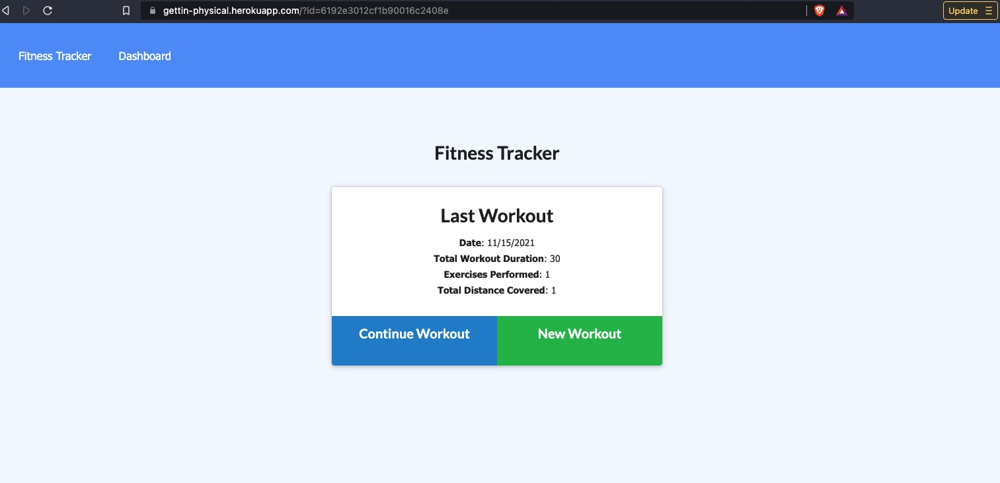
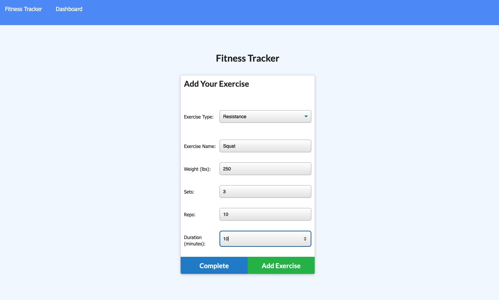
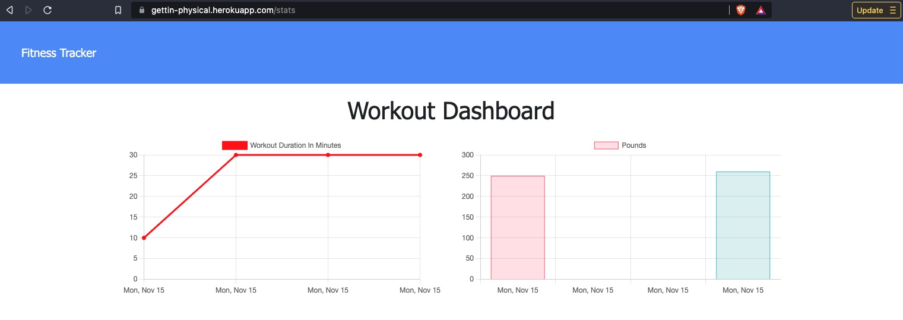
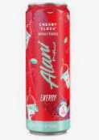

# Lets_Get_Physical_TT

  ## Table of Contents
  * [Description](#descrip)
  * [Installation](#install)
  * [Usage](#usage)
  * [Contributions](#contri)
  * [Tests](#tests)
  * [Contact & Qustions](#contact)
  * [License](#license)
  * [Powered By](#powered-by)
  
  ### Description:
      "ARRRRRUUUUUGGHHHH!!!!," the lonely traveler cried out in pain as he was slammed against the cold, damp structure.  He thought it was fitting that he had literally hit a wall in this journey.  Almost as appropriate was the fact that is was Mongo and his mongoose that we dealing him this massive battle.  "How can you fight something that isn't Rational!"  "BANG!" Another Object smashed to pieces almost him right in the face.  This could be the end of his travels.  The adventure has to end at some point for us all.  His body had been broken by the long and difficult path.  Why are paths hidden and so difficult to find was something that he nver really grasped. The handlebars had been pulled from his fingers right when he was feeling comfortable and now, things were looking grim!

      He could see the snarled grin of that annoying mongoose and smell the wretched stench of Mongo.  Being gagged by the rancid smell of death wasn't exactly what he had imagined the end would be like, but we don't always get to choose.  The oaf slowly approched and the hero braced for the final blow.  He had struggled to get back on his feet, but his mind and body were failing him.  This workout had taken its toll!

      Just as all hope seemed lost he heard the happy voices coming from outside.  What is this?!? Could there be other travelers out there as well that could lend a hand in his fight? The beast was distracted and went towards the jovial sounds.  His ears did not deceive him.  It was Brian the Brave and Chuck the Slayer of Turkeys!

      The beaten novice cried out for help with what breath he had left. Just then, the other two warriors came rushing into the darkness.  Their light made the evil beasts shield their eyes.  This one move created an opening and the monsters were slayed with a swift attack from Chuck.  Brian was there to stop any retreat, so the mongoose lashed out at him.  With a masterful move, Brain used the mongoose's momentum against him and flung the nasty create off a cliff.  As Chuck laughed at this, Mongo punched him in the face and blurted out something about there not being any heroku seeds for him.  The broken travel didn't understand why seeds would come up in the middle of this epic struggle, but Chuck had paid the price for his short lived laughter.  His long hair being blown by the strong breeze and a crooked smile that came across his face seemed to show that he enjoyed this fight.  Chuck yelled out and charged the beast was swiflty as the mongoose had flown over the cliff, but this time it was Mongo who paid the price.  Just before the broken traveler slipped into unconciousness, he saw the two fellow travelers celebrating their well earned victory.

      The weary wonderer had barely avoided defeat, and he was thankful to his two fellow adventurors.  It was good to have others out there that knew the struggle and were willing to help, and just maybe it was possible for this journey to end well for everyone!
 

  
  ### Installation:
      web based application
The app allows you to enter select if you want to contiune a workout by adding an exercise or starting a new workout.

You can add any exercise by by completing the information

You can see your progress with the Dashboard

[Gettin Physical](https://gettin-physical.herokuapp.com/stats)
[Gittin Hub](https://github.com/DerTodd/Lets_Get_Physical_TT)

  
  ### Usage: 
      Tracking exercise

  
  ### Contributions:
      Brian and Chuck

  
  ### Tests
      N/A

  
  ### Contact & Qustions
  If you have any questions, suggestions or concerns, please contact me at:  
  GitHub  
  https://github.com/DerTodd  
  email  
      todd.taylor@utexas.edu  

  
  ### License:
  [MIT](https://opensource.org/licenses/MIT)

  
  #### Powered By
    
    
   